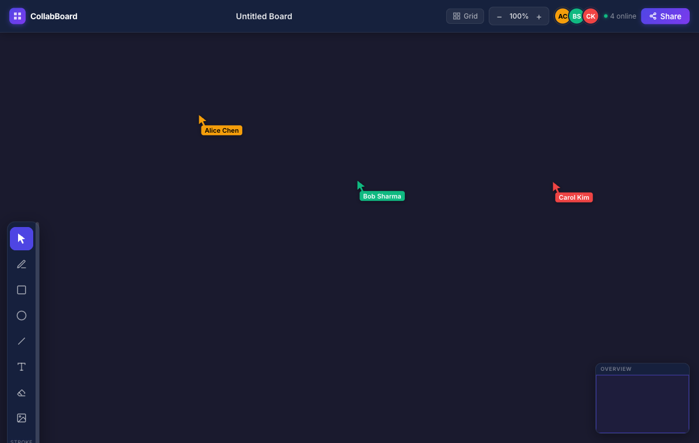

# 🎨 CollabBoard

> **Real-time collaborative whiteboard — draw, sketch, and brainstorm together, live.**

[](https://collabboard-phi.vercel.app)

---

## ✨ Features

- 🖊️ **Full drawing toolkit** — Pen, Rectangle, Circle, Line, Text, Eraser, and Image upload with adjustable stroke width (1–32px) and color
- 🔄 **Real-time sync** — every canvas change is instantly broadcast to all collaborators via Socket.io WebSockets
- 👥 **Live presence** — see who's online with colored avatars and live cursors for each connected user
- ↩️ **Undo / Redo** — full history with `Ctrl+Z` / `Ctrl+Y` keyboard shortcuts
- 🌙 **Dark / Light theme** — persisted to localStorage, applied across all UI and canvas elements
- 📥 **Export as PNG** — download the entire board with one click
- 📱 **Mobile-first** — touch drawing, pinch-to-zoom, and a bottom-anchored toolbar for small screens

---

## 🖼️ Screenshot



---

## 🛠️ Tech Stack


---

## 🚀 Local Setup

### Prerequisites

- Node.js 18+

### 1. Clone the repo

```bash
git clone https://github.com/pratham7711/collabboard.git
cd collabboard
npm install
```

### 2. Start the Socket.io server

```bash
npm run server        # starts WebSocket server on ws://localhost:3001
```

### 3. Start the frontend

```bash
npm run dev           # Vite dev server with /socket.io proxy to :3001
```

Open [http://localhost:5173](http://localhost:5173) — open a second tab or browser window to see real-time collaboration in action.

---

## 🌐 Environment Variables

| Variable | Where | Description |
|---|---|---|
| `VITE_SOCKET_URL` | Vercel | URL of the deployed socket server (e.g. Railway) |
| `PORT` | Railway / Render | HTTP port for socket server (auto-set by platform) |
| `CORS_ORIGIN` | Railway / Render | Allowed frontend origin |

---

## ☁️ Deployment

**Frontend → Vercel**

```bash
vercel deploy --prod
```

**Socket Server → Railway**

[](https://railway.app)

The `railway.json` and `render.yaml` in the repo configure the socket server automatically. Set `CORS_ORIGIN` to your Vercel URL and add `VITE_SOCKET_URL` in Vercel environment variables.

---

## ⌨️ Keyboard Shortcuts

| Key | Tool |
|---|---|
| `V` | Select |
| `P` | Pen |
| `R` | Rectangle |
| `C` | Circle |
| `L` | Line |
| `T` | Text |
| `E` | Eraser |
| `Ctrl+Z` / `Ctrl+Y` | Undo / Redo |
| `Ctrl+A` | Select All |

---

## 📄 License

MIT — free to use, modify, and distribute.

---

<p align="center">Built by <a href="https://github.com/pratham7711">Pratham</a> · Powered by Fabric.js + Socket.io</p>
